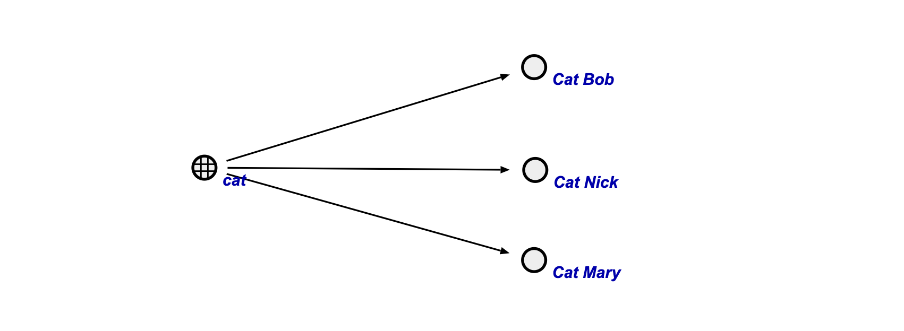
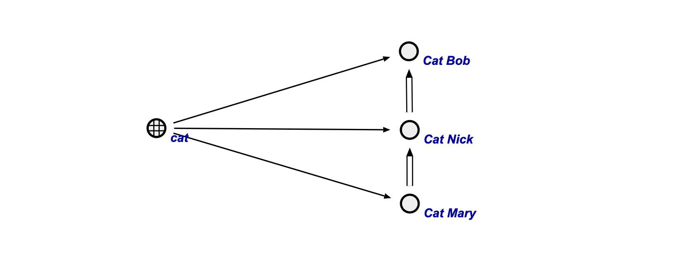
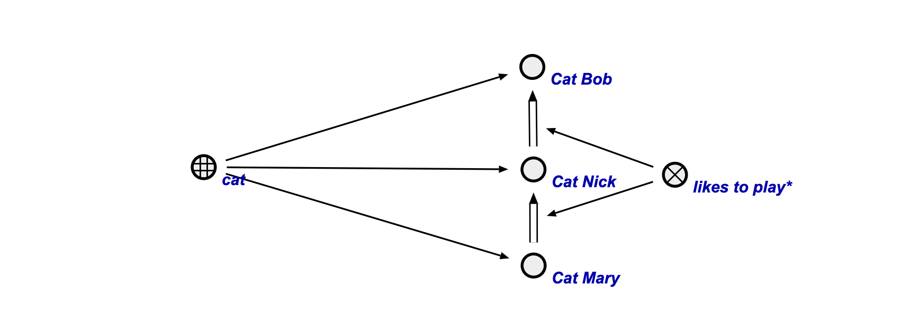
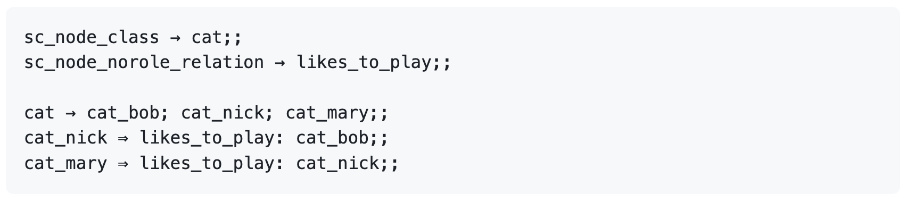
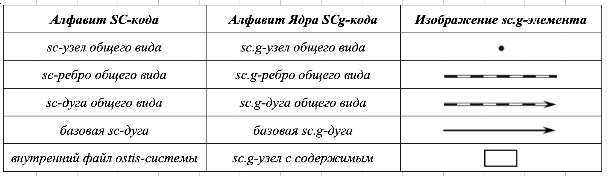
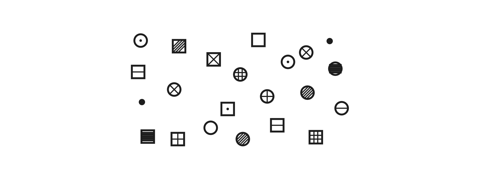
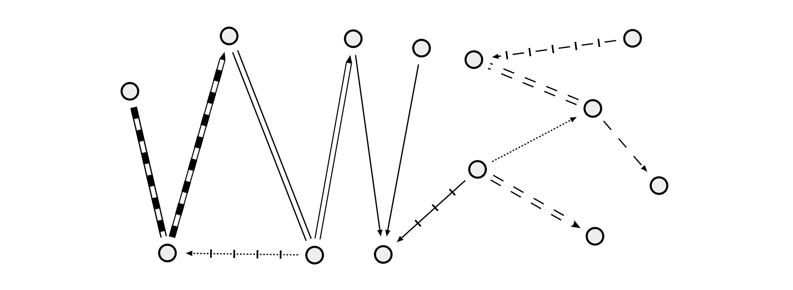
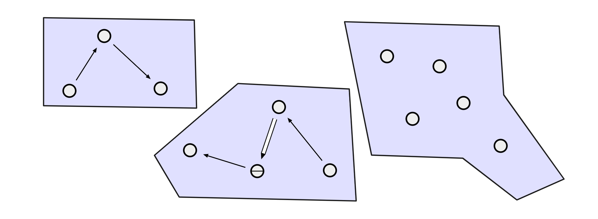
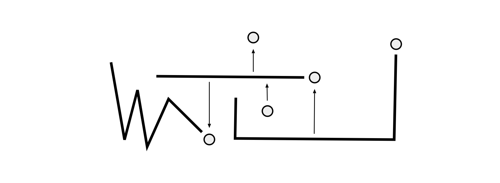
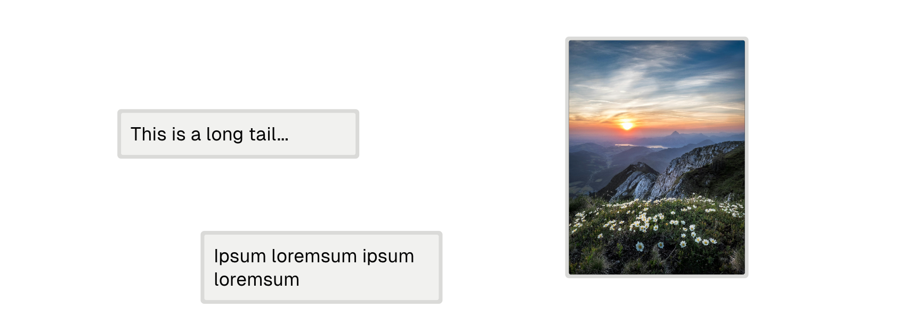

# Enigraph
## Background behind the project
Data and knowledge represent an important and irreplaceable part of our lives. They form the foundation of human understanding, decision-making, and progress across all possible fields. In today's information-driven world, the ability to effectively manage, interpret, and utilize data and knowledge has become crucial for individuals, organizations, and societies as a whole.

Despite many contradictory opinions around the difference between data and knowledge caused by misunderstanding of their proper definitions due to sometimes blurred boundaries between these two concepts, these terms are in fact well studied by semiotics.

Data is information presented in a specific sign system and on a specific material carrier to ensure the possibility of storage, transmission, reception, and processing. It is separate ordered facts characterizing objects, processes, and phenomena of a subject area, as well as their properties.

Knowledge is the patterns of a subject area (principles, connections, laws) obtained as a result of practical activities and professional experience, allowing specialists to set and solve problems in this area. At this point, knowledge can be well-structured data, data about data, or metadata.

In short, data are organized tables, catalogs, etc., while knowledge is comprehended information.

In order to move the progress of complex automatization of all areas of human endeavor, a transition from data-driven systems to knowledge-driven systems should take place.

### The future of knowledge representation

Every academic discipline or field, in creating its terminology, thereby lays the groundwork for an ontology. Each uses ontological assumptions to frame explicit theories, research and applications. Improved ontologies may improve problem solving within that domain, interoperability of data systems, and discoverability of data.

In information science, an ontology encompasses a representation, formal naming, and definitions of the categories, properties, and relations between the concepts, data, or entities that pertain to one, many, or all domains of discourse. It consists of a hierarchy of concepts of a subject area, connections between them and laws that operate within this model. In other words, ontology is a semantic specification of knowledge.

In accordance with the OSTIS technology, the core of representation of any ontology is SC-code, which is abstract by its nature and may be expressed for humans through different forms. One of the most efficient form for describing ontologies is SCs-code, and the most convenient for visualization is SCg-code. While SCs-code is a textual representation of SC-code and has a very high degree of flexibility when describing complex ontologies, SCg-code is a graphical representation of SC-code and displays it visually as a graph structure, which significantly simplifies the understanding of ontologies for human readers, usually making it naturally intuitive.

The base elements of SCg-code are vertices (concepts, entities) and edges (relations between concepts and entities). There are a lot of different types of vertices and edges making up the alphabet of SCg-code, that can be used to describe knowledge with regard to all its various attributes (properties), such as relevance, uncertainty, abstraction, relativeness and so on.

When it comes to describing complex knowledge, as of today, SC-code is the most powerful, universal, and functional way of knowledge representation, providing both low-level and high-level features and having varied forms of its representation for humans.

### Example of knowledge representation using SC-code

Considering there are three cats Bob, Nick, and Mary, these cats can be represented as simple entities (as plain circles in SCg), and the concept of “cat” can be defined as a class of those entities.

In order to connect the defined entities and classes with each other, let's first consider two types of arrows, representing relations between entities:
- Has-a arc — simple line with an arrowhead on the end.
- Common arc — double line with an arrowhead on the end.

Has-a arc is used to define a relation that indicates that a certain entity belongs to a certain class. Bringing the example with cats back, one can use the has-a arc to connect the concept "cat" with three its concrete instances — Bob, Nick, and Mary (see figure below).



This way, it was shown that each of the entities named "Cat Bob," "Cat Nick," and "Cat Mary" are in fact cats, belonging to the class of cats.

However, if considering a more complex fragment of knowledge, then within the ontology of cats a different relation may appear between objects, that can be custom, and not necessarily related to belonging to a class or whatever else.
Let's consider that cat Mary likes to play with cat Nick and cat Nick likes to play with cat Bob. In this case, this knowledge can be described by defining a "likes to play" relation and linking the cats with common arcs accordingly that will represent the defined relations:



Common arcs can define any custom releation between objects except for the relation of belonging, for which a special type of arc is defined (has-a arc). Such relations are called no-role relations. In order to distinguish different no-role relations from each other, it should be shown that the corresponding arcs are the elements of a certain class of relation:



In SCg, a class of relation is displayed as a circle with an "X" inside, and in the provided example it can be named "likes to play" to define the meaning of relation.

This way, using the SCg language, it was shown that there is a concept "cat" which has three instances defiend, namely, cat Bob, cat Nick, and cat Mary, and that cat Mary likes to play with cat Nick and cat Nick likes to play with cat Bob.

In the SCs language (textual representation of SC-code), this ontology can be described as follows:



## Motivation

Despite the novel concept of knowledge representation through SC-code provided by OSTIS technology that can be further explored [here](https://github.com/ostis-ai), and all of the toolings it provides for developing and maintaining ontologies of all kind of complexity, leaving competitors far behind, a new professional tooling for ontology visualization and visual manipulation needs to be invented to meet the new standard of knowledge engineering and help developers to build and explore complex ontologies quickly, efficiently, and conveniently.

There were several successful attempts made to create an SCg-editor during the early years of OSTIS development, and those editors are still widely used nowdays by knowledge engineers and students to operate with ontologies visually. However, those editors were not maintained for quite too many years now, and the overall development technologies have moved forward drastically since then, so have the requirements for the editor and user experience.

This project aims to cover the need for a new professional graph editor supporting SCg constructions, but also to challenge all the existing graph visualization libraries by providing developers an absolutely decomposed yet composable library for graph visualization and manipulation, with a wonderful developer experience and magical type system, meeting the quality standards of Ennealand.

One of the main ideas of this project is to provide developers an ability to create graph visualizations or editors based on their own needs and requirements, writing as little code as possible, and instead of overriding or suppressing functionality that is not needed, simply not including it beforehand. On the other hand, any extension for the graph editor that a target developer may need to create in order to include their own specific functionality should have an absolute control over any required element of the editor and other dependant plugins, if needed. So a proper architecture and a well-designed API should first be developed.

<!-- ## Existing solutions -->

## Designing architecture

Having the above idea in mind, and multiple sketch versions already developed for different projects (e.g. interactive-discrete-math), the v1 version of Enigraph that is now being actively developed aims to have 5 key conceptual parts: core, components, events, plugins, and config.

### Core

The core of Enigraph does not contain nor provide any visual elements, but is rather a frame for all of the components and plugins to be placed in. It provides interfaces for both SVG and HTML components or plugins to be rendered, both on a static or dynamic surface; and also places additional UI elements defined in the graph configuration into special intermediate layers between the surfaces.

[picture of structure]

### Components

Simply put, component is a UI element defined on the editor canvas. In case of basic graph, there should be just two components defiend: vertex and edge. But for more complex or alternative structures, more or different components can be added.

Any component should in fact be a JSX component, that is a function that takes an object with props as its first and the only argument and returns JSX element as the result.

Below is an example of a basic node component:

```ts
type NodeProps = { x: number, y: number, id: string }
const Node = (props: NodeProps) => <circle cx={x} cy={y} r='10' />
```
Please note that `id` is a required prop for any component. It must be a string or a number that uniquely represents and identifies the component.

Now, in order to see that component in action, an instance of Enigraph should be created. This can be done by instanciating an EnigraphFactory, connecting all components, plugins, events, and a config (if needed), and then running `.create()` method to make the factory produce an instance of Enigraph.

Any required component can be included as simply as by calling `.add()` method and passing a name of component and then the component itself. Below is an example of creating an Enigraph instance with the previously created `Node` component.

```ts
const GraphDemo = new EnigraphFactory()
  .add('node', Node)
  .create()
```
The string name of component (first argument of the `.add()` method) may be custom and is primarily used as a name for the prop of the generated Enigraph instance.

```ts
const nodes = signal([
  { id: 0, x: 10, y: 20 },
  { id: 1, x: 10, y: 50 },
  { id: 2, x: 30, y: 70 }
])

const App = () => (
  <div>
    <GraphDemo nodes={nodes} />
  </div>
)
```

Alternatively, were the component named `'cat'`, the `GraphDemo` would expect `cats` prop to be passed, containing an array of props for the registered component.

```ts
const GraphDemo = new EnigraphFactory()
  .add('cat', Meow)
  .add('dog', Puppy)

/* ... */

<GraphDemo cats={...} dogs={...} />
```


### Plugins

While components are used to register UI elements, plugins define and extend the business logic of Enigraph and the user interaction in general. Each plugin should represent a specific feature and be excusively responsible for its work.

Just like components, plugins must be immutable and pure functions. However, unlike components, some plugins may depend on others. For this purpose, Enigraph factory comes with a concept of context.

Each plugin is a function that receives an object called context as its argument and must produce another object that will be an addition to the context. This way, plugins can expose its state and methods to control the functionality it is responsible for to other plugins so they can use the exposed state in their conditional logic and invoke the exposed methods under additional user interactions.

Below is an example of using plugins and leveraging the context:
```ts

type SelectionProps = {
  nodes: ReadonlySignal<NodeProps[]>
}

const withSelection = (ctx: SelectionProps)  => {
  const ids = useSignal(new Set(ctx.nodes.peek().map(node => node.id)))
  const addSelection = (id: number) => ids.value = new Set(ids.value.add(id))
  const clearSelection = () => ids.value = new Set()
  const selection = useComputed(() => ids.value)
  return { selection, addSelection, clearSelection }
}


type LocalMutationsProps = {
  nodes: ReadonlySignal<NodeProps[]>
  addSelection?: (id: number) => void
}

const withLocalMutations = (ctx: LocalMutationsProps) => {
  const addNode = (x: number, y: number) => {
    const id = ctx.nodes.value.length
    ctx.nodes.value = [...ctx.nodes.value, { x, y, id }]
    ctx.addSelection?.(id)
  }
  return { addNode }
}

const GraphDemo = new EnigraphFactory()
  .add('node', Node)
  .plug(withSelection)
  .plug(withLocalMutations)
  .plug(ctx => {
    ctx
    // ctx: {
    //   nodes: ReadonlySignal<NodeProps[]>
    //   selection: ReadonlySignal<Set<number>>
    //   addSelection: (id: number) => void
    //   clearSelection: () => void
    //   addNode: (x: number, y: number) => void
    // }

    return {}
  })
  .create()
```

Notice that the `nodes` field already exists in the context despite it was never defined before. This field gets included in the context because of a component being registered before with the name `'node'`. Where does the value of `nodes` come from then?

This leads to a very important point for understanding and proper leverage of plugins.

In fact, the chain of plugins gets executed only during the render of the Enigraph instance later created. This allows for using one Enigraph instance (which is actually a React component, produced by invoking `.create`) in multiple places without sharing the same state of plugins. Thus, the `GraphDemo` from any of the above examples represent a React component with a certain configuration (components, plugins, etc.) built-in and can be mounted in as many different places as needed, without breaking the core concepts of React components, and maintaining its stable, independant work.

Therefore, within the **direct scope** of plugins, **no state subscription should be made and only hooks are allowed to be used**. Since callbacks and functions defined inside a plugin have a different scope, the above statement is not applicable to them, unless those functions are directly invoked in the scope of a plugin.

```ts
const withSelection = ctx => {
  // In-plugin scope
  const selection = signal([]) // Not allowed
  const selection = useSignal([]) // OK

  const nodes = ctx.nodes.value // Not allowed
  const nodes = ctx.nodes.peek() // OK

  const startSelecting = (e?: MouseEvent) => {
    // Out-of-plugin scope
    const state = useSignal(true) // Not allowed
    const state = signal(true) // OK

    const nodes = ctx.nodes.value // OK
  }

  startSelecting() // Not allowed

  return { startSelecting }
}
```

Any violation of the above rule will cause extra re-rendering of the entire Enigraph instance, creating unnecessary overhead and potentially resulting in performance issues.

### Events

Enigraph events is a special interface allowing to handle any kind of events happening within Enigraph. In order to subscribe to an event, the `.on()` method of a factory should be called with two arguments passed:

1. Event name in the format `<scope>:<event-name>`
2. Hadler function of type `(ctx: Context, e: <EventType>) => <ReturnType>`

An example of subscribing to and handling a global `keyDown` event is shown below.

```ts
.on('global:keyDown', (ctx, e) => {
  if (e.code === 'Escape') {
    ctx.clearSelection()
  }
})
```
Notice that the `e` argument is already of type `KeyboardEvent` which is a proper type definition for the global `keyDown` event.

By default, there are three scopes defined: `global` (the window object), `graph` (the top element of Enigraph), and `svg` (the SVG element containing all svg-components inside). However, the registered components may have their own events that need to be handled with an access to the factory context. Therefore, the name of any registered component is also a valid scope.

In order to define an event for a component, an optional field starting with `'on'` should be included in the type declaration of the component props (see an example below).
```ts
type NodeProps = {
  x: number
  y: number
  id: string
  onMouseDown?: (e: MouseEvent) => void
  onCustomEvent?: (e: CustomEvent) => void
  onFoo?: ({ a, b, c }: FooArgs) => { bar: BarResult }
}

const Node = (props: NodeProps) => { /* ... */ }
```

Now, these events can be handled from the factory as follows:

```ts
const GraphDemo = new EnigraphFactory()
  .add('node', Node)
  .on('node:mouseDown', (ctx, e) => {
    e // e: MouseEvent
  })
  .on('node:customEvent', (ctx, e) => {
    e // e: CustomEvent
  })
  .on('node:foo', (ctx, e) => {
    e // e: FooArgs
    return { bar: 'my required bar-result' }
  })
```

The reason of coming up with such conceptual decision, however, is not only to provide the context object to event handlers, but also to give plugins an ability to combine their behavior of handing certain events with other plugins, which usually comes with some conditional logic and utilizing the state of other plugins.

For example, let's consider two plugins: one is responsible for area selection and the other for moving the canvas around. There may be cases when an external project would need a graph editor with only one of the functionalities, e.g. either with area selection, or with movable canvas. Thus, these plugins must be isolated and independant from each other.

```ts
import { withAreaSelection, moveSelection } from '@enigraph/plugins/area-selection'
import { withMovableCanvas, moveCanvas } from '@enigraph/plugins/movable-canvas'

const GraphWithAreaSelection = new EnigraphFactory()
  .add('node', Node)
  .plug(withAreaSelection)
  .on('global:mouseMove', moveSelection)
  .create()

const GraphWithMovableCanvas = new EnigraphFactory()
  .add('node', Node)
  .plug(withMovableCanvas)
  .on('global:mouseMove', moveCanvas)
  .create()
```

Supposing `moveSelection` updates the visual area of selection on mouse press & move, and `moveCanvas` moves the canvas following the cursor on mouse press & move either, it gets challenging when attempting to use both plugins because a conflict then occurs and the behavior should be modified.

In this case, a higher-level handler should be created that wraps both `moveSelection` and `moveCanvas` handlers and makes a proper integration of them.

```ts
import { withAreaSelection, moveSelection } from '@enigraph/plugins/area-selection'
import { withMovableCanvas, moveCanvas } from '@enigraph/plugins/movable-canvas'

const GraphWithSelectionAndCanvas = new EnigraphFactory()
  .add('node', Node)
  .plug(withAreaSelection)
  .plug(withMovableCanvas)
  .on('global:mouseMove', (ctx, e) => {
    if (e.shiftKey) moveSelection(ctx, e)
    else moveCanvas(ctx, e)
  })
  .create()
```

Another useful usecase for utilizing the conceptual decision of events is to create "behavior builders".

```ts
import { moveSelection } from '@enigraph/plugins/area-selection'
import { moveCanvas } from '@enigraph/plugins/movable-canvas'

type Key = 'meta' | 'ctrl' | 'alt' | 'shift'
type Options = { selection?: Key; canvas?: Key }

export const moveSelectionAndCanvas = (options: Options) => (ctx, e) => {
  if (!options.selection || e.[`${options.selection}Key`]) moveSelection(ctx, e)
  if (!options.canvas || e.[`${options.canvas}Key`]) moveCanvas(ctx, e)
})
```

This function can even be shipped as a separate package!

Then, it can be used as follows providing developers a declarative way to define the behavior of both plugins:

```ts
import { moveSelectionAndCanvas } from '@enigraph/events/selection-canvas'

const GraphWithSelectionAndCanvas = new EnigraphFactory()
  .add('node', Node)
  .plug(withAreaSelection)
  .plug(withMovableCanvas)
  .on('global:mouseMove', moveSelectionAndCanvas({ selection: 'shift', canvas: 'alt' }))
  .create()
```

This way, the concept of decomposability of all these event-handlers and behavior-definers, along with the mechanism for their simple abstraction and seamless integration with each other, allows for building a great ecosystem around Enigraph that challenges other competitors.

### Configuration

Configuration is the last piece of the Enigraph architecture to review. It provides an interface to include custom UI elements in various layers of the core as shown on [this figure](#core), but also a way to define custom attributes to the top element of Enigraph (`enigraphProps`) or to the SVG element that contains all svg-components inside (`svgProps`).

The general type declaration of Enigraph configuration looks as follows:
```ts
configure: ctx => {
  enigraphProps?: PropertiesOnly<JSX.HTMLAttributes<HTMLDivElement>>
  svgProps?: PropertiesOnly<JSX.HTMLAttributes<SVGSVGElement>>

  before?: (() => JSX.Element)[]
  after?: (() => JSX.Element)[]
  staticBefore?: (() => JSX.Element)[]
  staticAfter?: (() => JSX.Element)[]
  htmlAfter?: (() => JSX.Element)[]
}
```

The most common and recommended usage of this feature is to include UI elements that are part of plugins to the canvas. For example, the area-selection plugin used in previous examples may need to render a transluent rectangle that would represent the current area of selection while mouse is moving (just like on desktop of any OS).

However, since the transluent rectangle is a **singular element** that is also a part of a plugin, it should not be considered as an Enigraph component, but rather as an external React component shipped along with the plugin (see `AreaSelection` in the provided example below).

```ts
const GraphDemo = new EnigraphFactory()
  .add('node', Node)
  .plug(withAreaSelection)
  .on('global:mouseMove', moveSelection)
  .configure(ctx => ({
    enigraphProps: { style: 'background: skyblue' },
    staticAfter: [() => <AreaSelection {...ctx.areaSelection} />]
  }))
```

To see the meaning of config properties like `before`, `after`, etc., please refer to the structure of the Enigraph core described [here](#core).


## Building ecosystem

Despite the great architecture designed that was accurately implemented, if referring to the original [motivation](#motivation) of this project then it turns out that building the core library only partially covers the goal to build a new professional graph editor that supports SCg constructions.

So, once the core library is ready, it's time to supply it with a standard set of components and plugins, stepping into creating a starting point of the future ecosystem of Enigraph. And to be aligned with the goal of this project, let it be all the necessary components and plugins required to build a convenient and fully-featured SCg editor.

### Components

In order to implement SCg constructions as Enigraph components, let's first review the overall structure of SCg and what it is build of.

As per specification, SCg-code consists of SCg-code Core and 7 its extensions.

Since SCg-code is just a visual representation of SC-code, the alphabet of SCg-code Core is equivalent to the alphabet of SC-code as shown in the table below:



In order to include these SCg elements in the editor, the UI compoments should be defined. Thus, the *scg-node of common type* can be a Node component, and the *scg-edge of common type* along with the *scg-arc of common type* and *basic scg-arc* can be Edge components. The *internal file of ostis-system*, also called as *scg-node with contents* in the SCg-code Core alphabet, is a special element that represents a file (it can be a text file, a media file, or any other custom file), so due to the visual aspect of SCg-code, it can be displayed as a preview of that file (e.g. an image can be rendered, or a video preview can be embedded) and so will be called as Contents component.

The first extension introduces label visual elements for *main identifiers* and *system identifiers*. Essencially, it is a text that is included near a Node component, so this extension does not require introducing any additional components but rather extends the Node component.

The extensions from second to fifth extend the alphabet with a various types of nodes and edges. The second extension brings constant permanent entities (nodes and edges) of various types (class, metaclass, role-relation, struct, primary entity, non-binary connection, edge, arc, basic arc, negative basic arc, fuzzy basic arc), the third extension brings constant temporal entities of the same types, the fourth one brings variable permanent entities, and the fifth one — variable temporal entities.

The sixth extension comes with two special additional elements for SCg-code: *scg-outline* and *scg-bus*.

Semantically, scg-outline is equivalent to scg-struct, and is a set of sc-elements the scg-images of which are placed inside the outline. The outline itself is displayed as a closed polygonal line with rounded corners, containing a fragment of SCg-code inside (which is the very images of sc-elements that belong to the outline). Since the essence of scg-outline is very similar to "grouping", making "groups" of certain elements, the component was named as Group component for simplicity.

Accordingly, scg-bus is incident to a specific scg-element and is semantically equivalent to it. It is displayed as a quite bold custom polygonal line and generally serves to extend the surface of an scg-node.

The seventh extension is related to transitioning from a 2D-representation to a 3D-representation, so will not be considered to be supported by the editor.

#### Node component
Below is an example of Node components:



#### Edge component
Below is an example of Edge components:



#### Group component
Below is an example of Group components:



#### Bus component
Below is an example of Bus components:



#### Contents component
Below is an example of Contents components:




<br>

---


### Autosize plugin
The autosize plugin sets `width` and `height` context states to the size of the Enigraph's parent element once mounted, and updates the states accordingly when window is resized. This is useful when the size of the editor is not known preliminary and is dependant on the parent element, container, or window.

#### Props
```ts
type Props = {
  
  ref: Ref<HTMLDivElement>
  width: Signal<number>
  height: Signal<number>
}
```
This plugin does not provide any additional context as it only mutates the values of the existing context.

Please keep in mind that mutating the existing context in plugins is **strongly discouraged**, unless a plugin has no dependencies other than the core ones and is **the only** source of these mutations.


### Movable plugin
The movable plugin (also known as canvas manipulation plugin) manages the movement and scaling of the workspace (canvas) where graph structures or other elements are located. The plugin allows for panning across the canvas and zooming in or out relative to the mouse cursor position. Both panning and zooming operations can be performed using either a touchpad, or mouse and mouse wheel.

#### Props
```ts
type Props = {
  /* core dependency */
  getInnerPoint: (x: number, y: number) => readonly [number, number]
}
```

#### Context

```ts
type MovableContext = {
  transform: ReadonlySignal<{
    x: Signal<number>
    y: Signal<number>
    zoom: Signal<number>
    moving: Signal<boolean>
  }>
  zoom: ReadonlySignal<number>
  localize: (x: number, y: number) => readonly [number, number]
  globalize: (x: number, y: number) => readonly [number, number]
  onwheel: (e: WheelEvent) => void
  startMoving: (e: MouseEvent) => void
  updateMoving: (e: MouseEvent) => void
  stopMoving: () => void
}
```

This plugin is special, because the exposed `transform` field is natively supported by the core of Enigraph and so it does not require any additional integration with other plugins, configs, or events.

The methods `localize` and `globalize` are used to transform the coordinates of an inner point from the absolute (actual, global) units to the relative (logical, local) ones in accordance with the current state of panning and zooming, and so vice versa.

The `zoom` state is commonly used by other plugins so it is additionally exposed as a separate read-only field.

The methods `onwheel`, `startMoving`, `updateMoving`, `stopMoving` can be invoked as desired inside Enigraph Events, for instance:
```ts
.on('graph:wheel', (ctx, e) => ctx.onwheel(e))
.on('graph:mouseDown', (ctx, e) => e.altKey && startMoving(e))
```

### Autolayout plugin
The autolayout plugin automatically arranges scg-elements using CoSE (Compound Spring Embedder) layout. It's particularly useful for organizing graph elements in a visually appealing and efficient manner without manual positioning of the elements.

#### Props
```ts
type Props<Id, NodeType, EdgeType> = {
  nodes: ReadonlySignal<BaseNodeProps<Id, NodeType>[]> // Node component
  edges: ReadonlySignal<BaseEdgeProps<Id, EdgeType>[]> // Edge component
  
  centerX: ReadonlySignal<number>
  centerY: ReadonlySignal<number>
}
```

The autolayout plugin does not provide any additional context, as it is applied only once the plugin is initialized, i.e. when Enigraph instance is first rendered, setting up an initial automatic arrangement of the graph elements. Thus, this plugin only modifies the existing context, updating the coordinates of each component (scg-element).

### Selection plugin
The selection plugin brings objects selection features for the editor. It implements multi-selection capabilities, outline nested selection, and rectangular area selection. 

To select objects using area selection, the user is prompted to choose a point on a canvas (x1, y1) using left mouse button press, and then while holding the mouse button, move mouse to the endpoint (x2, y2). As the mouse cursor moves, the plugin provides a visual highlight of the rectangular selection area (Figure X), as well as highlights all the editor objects that are within the selection area. When the user releases the left mouse button, the area selection ends, and all objects within the rectangular selection area become selected.

Additionally, this plugin offers a set of parameters that can be configured during selection initialization. For instance, one can set an inversion parameter, which will toggle the selection state of the selected objects, or a deselection parameter, which will remove the selected objects from the current selection based on the selection area.

#### Props

```ts
type Props<Id> = {
  nodes?: ReadonlySignal<BaseNodeProps<Id>[]> // Node component
  edges?: ReadonlySignal<BaseEdgeProps<Id>[]> // Edge component
  contents?: ReadonlySignal<BaseContentProps<Id>[]> // Contents component
  buses?: ReadonlySignal<BaseBusProps<Id>[]> // Bus component
  getInnerPoint: (x: number, y: number) => readonly [number, number] // Core
  localize?: (x: number, y: number) => readonly [number, number] // Movable plugin
  onSelectionStop?: (selection: Set<Id>) => void // Custom callback
  padding?: number // Custom parameter
}
```
#### Context
```ts
type SelectionContext<Id> = {
  areaSelection: ReadonlySignal<AreaSelectionProps>
  selection: ReadonlySignal<Set<Id>>
  isSelecting: ReadonlySignal<boolean>
  clearSelection: () => void
  startSelection: (
    e: MouseEvent,
    options?: { deselection?: boolean; selection?: boolean; inversion?: boolean; clear?: boolean },
    clickedId?: Id
  ) => void
  updateSelection: (
    e: MouseEvent,
    options?: { deselection?: boolean; selection?: boolean; inversion?: boolean }
  ) => void
  stopSelection: () => void
}
```

The `areaSelection` contains the state of rectengular selection area, such as visibility, coordinates, and type of selection.

The `selection` field is a set of ids of the elements that are currently selected, and `isSelecting` state indicates whether the selection is in process.

The exposed methods `clearSelection`, `startSelection`, `updateSelection`, `stopSelection` should be self-explanatory and be invoked within Enigraph Events under user-defined conditions, if needed.

### Draggable plugin
The draggable plugin, also known as objects movement plugin, is responsible for moving selected objects on the canvas. Since multiple objects can be selected at once (using the multi-selection feature of the selection plugin), this plugin supports simultaneous movements of multiple objects. To perform the movement, the user needs to select the objects they want to move, then press and hold the left mouse button over one of the selected objects, move the cursor to the desired position, and release the mouse button.

#### Props
```ts
type Props<Id> = {
  nodes?: ReadonlySignal<BaseNodeProps<Id>[]> // Node component
  edges?: ReadonlySignal<BaseEdgeProps<Id>[]> // Edge component
  contents?: ReadonlySignal<BaseContentProps<Id>[]> // Contents component
  groups?: ReadonlySignal<BaseGroupProps<Id>[]> // Group component
  selection: ReadonlySignal<Set<Id>> // Selection plugin
  isSelecting: ReadonlySignal<boolean> // Selection plugin
  getInnerPoint: (x: number, y: number) => readonly [number, number] // Core
  localize: (x: number, y: number) => readonly [number, number] // Movable plugin
  globalize: (x: number, y: number) => readonly [number, number] // Movable plugin
  zoom: ReadonlySignal<number> // Movable plugin
  
  /* custom callbacks */
  changeNodePosition?(element: BaseNodeProps<Id>, x: number, y: number): void
  changeContentPosition?(element: BaseContentProps<Id>, x: number, y: number): void
  nodePositionChanged?(element: BaseNodeProps<Id>): void
  contentPositionChanged?(element: BaseContentProps<Id>): void
}
```

#### Context
```ts
type DraggingContext = {
  isDragging: ReadonlySignal<boolean>
  isNoselect: ReadonlySignal<boolean>
  startDragging: (e: MouseEvent) => void
  updateDragging: (e: MouseEvent) => void
  abortDragging: (options?: { revert: boolean }) => void
  stopDragging: () => void
}
```

The `isDragging` state indicates whether certain elements are being dragged at the moment.

The `isNoselect` field serves as a state indicating that certain elements are currently being both selected and dragged (moved), which is used in order to disable elements highlighting on mouse over.

The exposed methods `startDragging`, `updateDragging`, `stopDragging` should also be self-explanatory and be invoked within Enigraph Events under user-defined conditions, if needed.

The `abortDragging` allows to forcefully interrupt the dragging process. If `reverse` option is specified, the dragged objects will return to their original positions.


### Autohide plugin
The autohide plugin provides rendering optimization by hiding elements that are outside of the screen, significantly reducing the amount of elements in the DOM and increasing the user interaction performance.

#### Props
```ts
type Props<Id, NodeType> = {
  nodes: ReadonlySignal<BaseNodeProps<Id, NodeType>[]> // Node component
  globalize: (x: number, y: number) => readonly [number, number] // Movable plugin
  /* core dependencies */
  centerX: ReadonlySignal<number>
  centerY: ReadonlySignal<number>
}
```

#### Context
```ts
export type AutohideContext<Id, NodeType> = {
  nodes: ReadonlySignal<BaseNodeProps<Id, NodeType>[]>
}
```

Please note that instead of mutating the existing context, this plugin overrides certain fields by exposing values under the same name, which is generally the right approach.

This leads to an important point: all plugins that are plugged before this particular plugin will access the original values of the context fields, whilst all plugins that are plugged after will access the updated (overridden) values.

This conceptual decision allows to eliminate implicit mutations of the context that easily lead to conflicts in case certain plugins must depend on the original values of the context. Thus, the order in which the plugins are included is rather important.

Taking the autohide plugin as an example, despite it removes elements that are beyond the boundaries of the visible canvas, the previously included selection and draggable plugins still access all the elements which allows to include the outside elements to the selection and then move them along with the inner ones, which would be the expected behavior by user.

### Renaming plugin
The renaming plugin provides support for renaming labels that were previously introduced with the first extension of SCg-code Core. The reason this renaming feature needs a dedicated plugin is because there is no way to make the label of the Node component editable due to the limitations of SVG. Thus, when editing a label, a separate HTML Input element should be rendered on top of the SVG label. Since this element should be singular (there is no need to have multiple input elements to be focused and active at the same time), it should be implemented as a plugin rather than a component, as per the rules described in the [architecture](#DesigningArchitecture) section.

#### Props
```ts
type Props<NodeProps> = {
  changeNodeLabel: (node: NodeProps, label: string) => void // Custom callback
}
```

#### Context
```ts
type RenamingContext<NodeProps> = {
  startRenaming: (node: NodeProps) => void
  stopRenaming: () => void
  isRenaming: ReadonlySignal<boolean>
  renamingNode: ReadonlySignal<NodeProps | null>
  renamingProps: RenamingAreaData
}
```

The exposed methods `startRenaming` and `stopRenaming` should be invoked based on the user-defined event handlers and conditions.

The `isRenaming` state indicates whether a label is in process of being renamed at the moment, and the `renamingNode` contains the details of the node that is being renamed.

The `renamingProps` field is exposed for the UI element (the renaming area) that should be included in the Enigraph configuration as follows:
```tsx
.configure(ctx => ({
  htmlAfter: [() => <RenamingArea data={ctx.renamingProps} />],
}))
```

### Disk plugin

The disk plugin provides users with a vertex and edge type selection menu which is a special interface element made in the form of a disk, on which the various options are located (different types of nodes or edges). This approach, compared to classic static menu, minimizes the distance the cursor needs to travel to make a vertex or edge type selection, significantly speeding up the user's work and increasing the usability of the editor. This plugin has its own configuration, which allows to define or limit selection options, change their order, and more.

#### Props
```ts
type Props = {
  getInnerPoint: (x: number, y: number) => readonly [number, number] // Core
  diskComponents: Record<string, DiskComponent> // Custom parameter
}
```

To define the `diskComponents` parameter, a special utility function `createDiskComponent` should be used:
```js
const diskComponents = {
  nodes: createDiskComponent({
    component: Node,
    types: ['var-norole', 'const-tuple', '...'],
    factory: getNodeProps,
    handler: (type, x, y) => addNode({ type, x, y }),
  }),
}
```
This allows for declaring and using absolutely any component with the disk plugin, not necessarily a node or an edge.

#### Context
```ts
type DiskContext = {
  isDiskOpened: ReadonlySignal<boolean>
  showDisk: (name: T, x: number, y: number) => void
  hideDisk: () => void
  diskProps: ReadonlySignal<BaseDiskProps<T, unknown, unknown>>
}
```

The `isDiskOpened` field indicates whether the disk is opened or not.

The methods `showDisk` and `hideDisk` should be invoked based on the user-defined event handlers and conditions, for instance:
```ts
.on('graph:mouseDown', (ctx, e) => {
  if (e.buttons === 1) {
    ctx.hideDisk()
    return
  }

  if (e.buttons === 2) {
    ctx.showDisk('nodes', ...ctx.getInnerPoint(e.clientX, e.clientY))
  }
})
```
Notice that the disk may provide type options for various components. To display the disk with options for a certain component, the name of the component should be passed as the first argument of the `showDisk()` method, which should match one of the keys of previously defined `diskComponents` parameter.

The `diskProps` field is exposed for the UI element that should be included in the Enigraph configuration as follows:
```tsx
.configure(ctx => ({
  staticAfter: [() => <BaseDisk {...ctx.diskProps.value} />],
}))
```

### Bus-draggable plugin
The bus-draggable plugin is used to modify the position of bus thumb (the end point). The reason this feature is not a part of the draggable plugin is because the bus has a different shape as well as a different behavior rules on dragging.

One of the additional featuers this plugin provides that is specific to buses only is magnetism. When hitting and moving the end point of a bus (called thumb), if the shift key gets held, the thumb will get aligned with the nearest axis relative to the bus start point (i.e. the node it comes from).

#### Props
```ts
type Props<Id> = {
  getInnerPoint: (x: number, y: number) => readonly [number, number] // Core
  localize: (x: number, y: number) => readonly [number, number] // Movable plugin
  zoom: ReadonlySignal<number> // Movable plugin
  changeBusPosition?(element: BaseBusProps<Id>, x: number, y: number): void // Custom callback
  busPositionChanged?(element: BaseBusProps<Id>): void // Custom callback
}
```

#### Context
```ts
type DraggingContext<Id> = {
  isBusDragging: ReadonlySignal<boolean>
  draggedBus: ReadonlySignal<BaseBusProps<Id> | null>
  startBusDragging: (e: MouseEvent, bus: BaseBusProps<Id>) => void
  updateBusDragging: (e: MouseEvent) => void
  stopBusDragging: () => void
  abortBusDragging: (options?: { revert: boolean }) => void
}
```

The `isBusDragging` state indicates whether a bus is being dragged at the moment, and the `draggedBus` contains the details of the bus that is being dragged.

The exposed methods `startBusDragging`, `updateBusDragging`, `stopBusDragging` should be self-explanatory and be invoked within Enigraph Events under user-defined conditions, if needed. See the below example of a basic usage of these methods:
```ts
.on('bus:thumbMouseDown', (ctx, { e, id }) => {
  e.stopPropagation()
  ctx.startBusDragging(e, ctx.buses.value.find(b => b.id === id)!)
})
.on('global:mouseMove', (ctx, e) => {
  ctx.updateBusDragging(e)
})
.on('global:mouseUp', (ctx, _e) => {
  ctx.stopBusDragging()
})
```

The `abortBusDragging` allows to forcefully interrupt the dragging process (similar to the draggable plugin). If `reverse` option is specified, the dragged bus will return to its original position state.

### Other plugins
There are several additional plugins that are not covered here since their development is still in progress or has been temporarily paused. These plugins include:
- Creation plugin
- Duplication plugin
- Grouping plugin
- Menu plugin
- Local-state plugin

## Themes and styling

A rather important topic to cever is styling. All components that are part of the standard library, provide a wide range of CSS variables allowing developers to customize the components appearance per their needs.

Below is an example of available variables for customizing the bus component:
```css
  --scg-bus-color: #36363b;
  --scg-bus-color-hover: #99bdf2;
  --scg-bus-color-selected: #4186f0;
  --scg-bus-thumb-size: 3.25px;
  --scg-bus-thumb-size-selected: 3.25px;
  --scg-bus-thumb-fill: #121215;
  --scg-bus-thumb-color: #99bdf2;
  --scg-bus-thumb-color-hover: #99bdf2;
  --scg-bus-thumb-fill-hover: #e2e2e2;
  --scg-bus-thumb-color-selected: #4186f0;
  --scg-bus-thumb-fill-active: #e2e2e2;
  --scg-bus-thumb-fill-selected: #121215;
  --scg-bus-thumb-border: 1.5px;
```

Below is an example of available variables for customizing the colors of the selection area:
```css
  --selection-area-fill: #1c80d712;
  --selection-area-color: #1c80d7;
  --selection-area-fill-deselection: #d71c1c12;
  --selection-area-color-deselection: #c02323;
  --selection-area-fill-selection: #1cd73812;
  --selection-area-color-selection: #269b37;
```

See other available variables in the [style.css](../src/dev/style.css) file.

## Development
Install dependencies:
```sh
bun i
```

Start the dev server:
```sh
bun dev
```

## Conclusion
Congratulations if you've made it this far!

We're actively seeking for your contribution to help the project grow and motivate us to develop it further:
- ⭐ Support the project by giving it a star.
- File an issue for a bug or a feature request.
- Comment an existing issue to say that you are tackling it.
- Create a pull request fixing a bug or implementing a new feature.
- Let us know what you think about this project in discussions.

<br>

**Happy hacking! ✌️**
